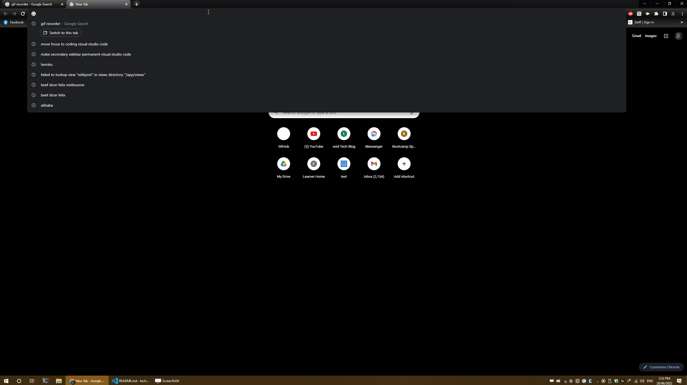
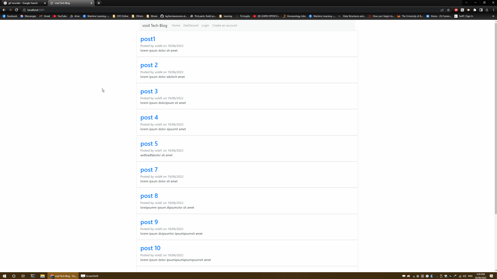
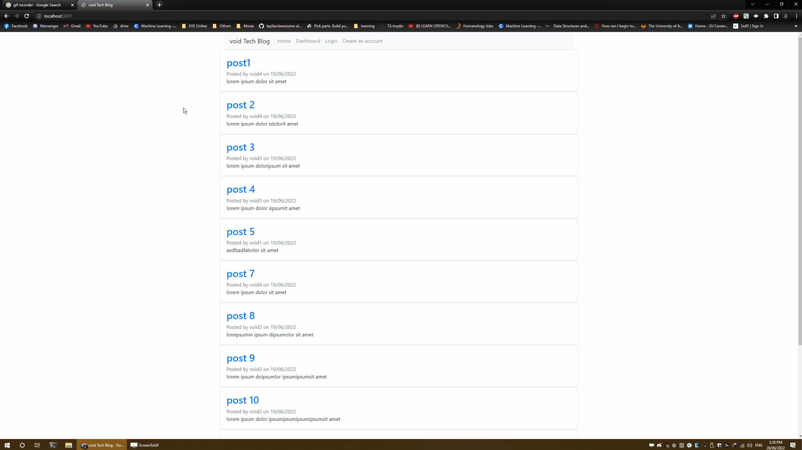

# Blog website
  
  
  ## Description
  This is a website which function as a blog post or social media post

  ## Table of Contents
  
  * [Installation](#installation)
  
  * [Usage](#usage)
  
  * [License](#license)
  
  * [Contributing](#contributing)
  
  * [Tests](#tests)
  
  * [Questions](#questions)
  
  ## Installation
  1. ```npm i``` to install dependencies
  2. create a ```.env``` file in root folder and add ```DB_NAME```, ```DB_USER```, ```DB_PW```, and ```session_secret``` parameter in it.
  3. initialize database by using the ```schema.sql``` inside db folder

  ## Usage
  ```npm run start``` to run the server.
  When the server is online, you will be able to look at the post that are posted by you or others, login in to the website and create, edit or delete your own posts or comments.

  There is a webpage for you to sign up as well.

  ### Demo
  Opening the website:

  

  Go to others link without login:
  

  Submitting comment without login:
  

  Go to dashboard after login:
  

  Add/Update/Delete post:
  

  Add/Update/Delete comment:
  


  ## License
```
This project is licensed under MIT license.
```
  
  ## Contributing
  email me

  ## Tests
  ```npm run seed``` to add random data to test.

  ```npm run debug``` to debug the server

  ## Questions
  
  If you have any questions, email me at [void2412@gmail.com](mailto:void2412@gmail.com).

  You can find more of my work at [void2412](https://github.com/void2412).